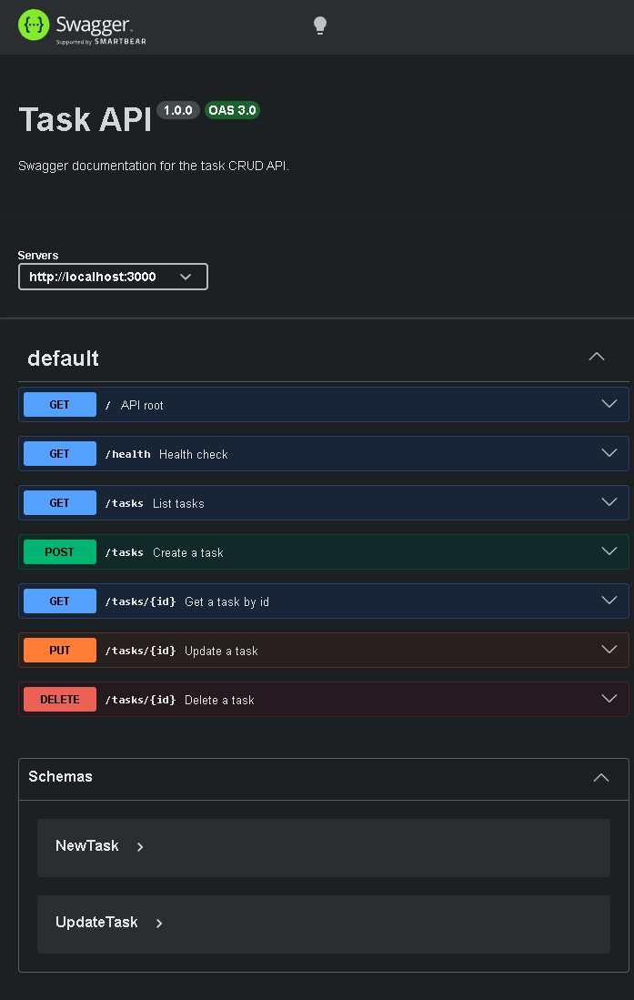
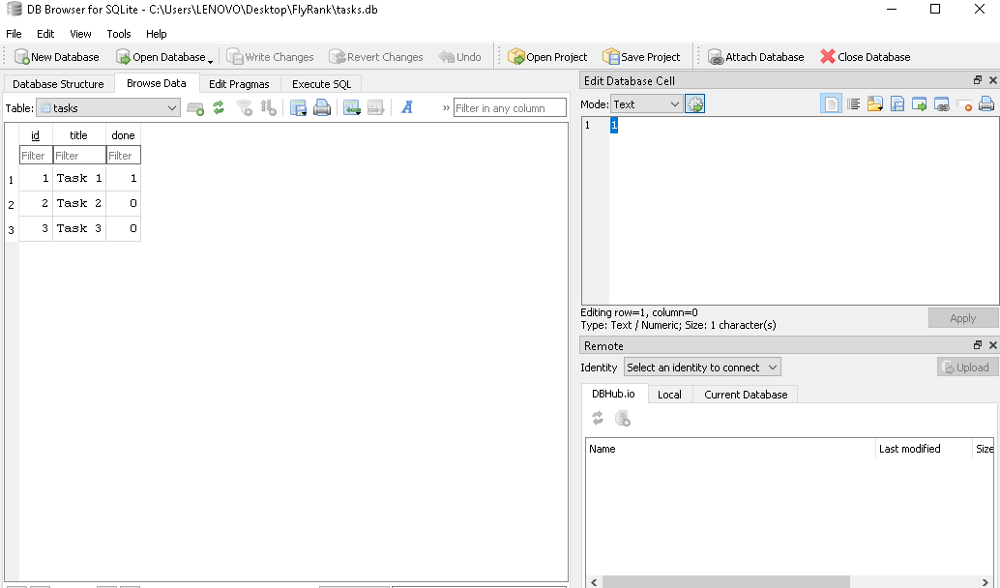

# Task API with SQLite and Swagger UI

This is a small Express task API backed by SQLite, with Swagger UI docs served at `/docs`.

## Why SQLite?

SQLite was chosen because the database is a single file, requires zero setup, and survives server restarts. It provides persistent storage without requiring a separate database server.

## Install and Run

From the repository root, install dependencies once and start the server with:

```bash
npm install
npm run app
```

The API runs on `http://localhost:3000` and the Swagger UI is available at `http://localhost:3000/docs`.

The database file is `tasks.db` in the repository root when started with the documented command. It is created automatically when the server starts. The file is usually git-ignored so each clone starts with a fresh database. On first startup, the app creates the `tasks` table and seeds three example tasks. Deleting `tasks.db` and running `npm run app` restores the initial data.

## Endpoints

| Method | Path | Description |
| --- | --- | --- |
| GET | `/` | API metadata |
| GET | `/health` | Health check |
| GET | `/tasks` | List all tasks |
| POST | `/tasks` | Create a task |
| GET | `/tasks/:id` | Get a task by id |
| PUT | `/tasks/:id` | Update a task |
| DELETE | `/tasks/:id` | Delete a task |

## Example `curl -i`

```bash
HTTP/1.1 200 OK
X-Powered-By: Express
Content-Type: application/json; charset=utf-8
Content-Length: 117
ETag: W/"75-06prUSBiJoPiNZzsqZ/Bl5NXjm0"
Date: Tue, 14 Jul 2026 20:38:27 GMT
Connection: keep-alive
Keep-Alive: timeout=5

[{"id":1,"title":"Task 1","done":true},{"id":2,"title":"Task 2","done":false},{"id":3,"title":"Task 3","done":false}]
```

## Swagger Screenshot



## Database Screenshot

Add a screenshot of `tasks.db` open in DB Browser for SQLite and save it as `db-browser-screenshot.png` in this folder.



## Example SQL Query

Example query run in Stage 4:

```sql
SELECT * FROM tasks;
```

This query returned the three seeded tasks:

```text
1 | Task 1 | 1
2 | Task 2 | 0
3 | Task 3 | 0
```
