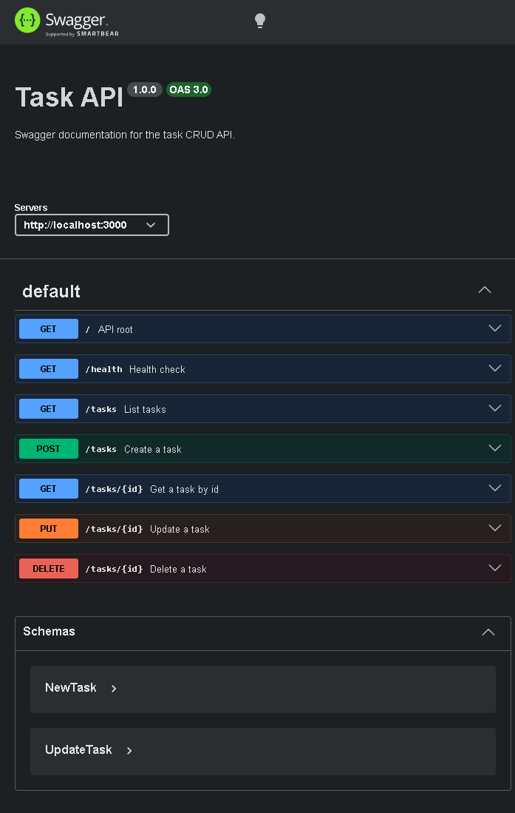

# Task API with Swagger UI

This is a small Express task API with in-memory storage and Swagger UI docs served at `/docs`.

## Install and Run

From `Backend-Track/Assgn2`, install dependencies and start the server with:

```bash
npm install && node app.js
```

The API runs on `http://localhost:3000` and the Swagger UI is available at `http://localhost:3000/docs`.

## Endpoints

| Method | Path | Description |
| --- | --- | --- |
| GET | `/` | API metadata |
| GET | `/health` | Health check |
| GET | `/tasks` | List all tasks |
| POST | `/tasks` | Create a task |
| GET | `/tasks/:id` | Get a task by id |
| PUT | `/tasks/:id` | Update a task |
| DELETE | `/tasks/:id` | Delete a task |

## Example `curl -i`

```bash
HTTP/1.1 200 OK
X-Powered-By: Express
Content-Type: application/json; charset=utf-8
Content-Length: 117
ETag: W/"75-06prUSBiJoPiNZzsqZ/Bl5NXjm0"
Date: Tue, 14 Jul 2026 20:38:27 GMT
Connection: keep-alive
Keep-Alive: timeout=5

[{"id":1,"title":"Task 1","done":true},{"id":2,"title":"Task 2","done":false},{"id":3,"title":"Task 3","done":false}]
```

## Swagger Screenshot


