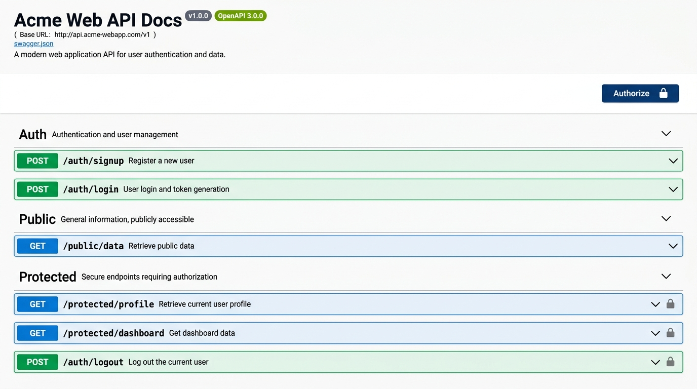

# FlyRank API - Supabase Auth & Swagger Documentation

A backend application built with Node.js, Express, and Supabase providing user registration, JWT-based authentication, and protected endpoints, fully documented using Swagger UI.

---

## Features
- **User Authentication:** Complete Signup, Login, and Logout flows powered by Supabase.
- **Route Protection:** Custom authentication middleware that validates Bearer JWT tokens.
- **Interactive Documentation:** A Swagger UI interface served at `/docs` with built-in JWT reuse (Authorize padlock).

---

## Environment Setup

Create a `.env` file in the root directory of the project and define the following variables:

```ini
# Supabase Configuration
SUPABASE_URL="your-supabase-project-url"
SUPABASE_KEY="your-supabase-anon-key"

# Server Port
PORT=3000
```

---

## Getting Started

### Installation
Install the project dependencies:
```bash
npm install
```

### Running the Application (One Command)
To run both the API server and the Swagger UI documentation server concurrently, run:
```bash
npm run dev
```

- **API Server:** http://localhost:3000
- **Swagger UI Portal:** http://localhost:3001/docs

---

## API Reference

The following table details the endpoints available in the system:

| Method | Endpoint | Authentication | Description |
| :--- | :--- | :---: | :--- |
| **POST** | `/auth/signup` | ❌ None | Register a new user with email and password. |
| **POST** | `/auth/login` | ❌ None | Authenticate credentials and return a JWT access token. |
| **POST** | `/auth/logout` | 🔒 Bearer JWT | Log out the currently authenticated user session. |
| **GET** | `/public/info` | ❌ None | Retrieve a general public greeting message. |
| **GET** | `/protected/profile` | 🔒 Bearer JWT | Retrieve profile details of the authenticated user. |
| **GET** | `/protected/dashboard` | 🔒 Bearer JWT | Retrieve dashboard information for the authenticated user. |

---

## Swagger UI Screenshot

Below is a preview of the interactive API documentation containing the Authorize option and padlock icons for protected routes:


